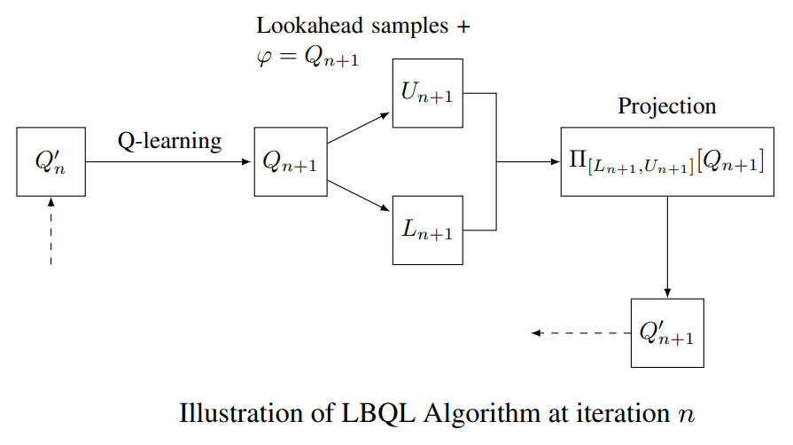

# Lookahead-bounded Q-learning
**Authors:** Ibrahim El Shar and Daniel Jiang 

This is the source code for our paper "Lookahead-bounded Q-learning" published at ICML 2020.

## Description
We propose a new provably convergent variant of Q-learning that leverages upper and lower bounds derived using information relaxation techniques to improve the performance of standard Q-learning.

## Citation
You can use the following Bibtex entry to cite our paper:
~~~bib
  @article{elshar2020lookahead,
    Title = {Lookahead-bounded Q-learning},
    Author = {Ibrahim El Shar and Daniel Jiang},
    journal={Proceedings of the 37th International Conference on Machine Learning (ICML)},
    Year = {2020},
    address={Vienna, Austria}
  }
~~~  
  Installation
-------------
Code was tested on Python version 3.6

Build a working python enviromnent for e.g. using [Anaconda](https://www.anaconda.com/).

Install packages from `requirements.txt`

Clone this repo: 

~~~bash
	git clone https://github.com/LBQL_ICML2020.git
~~~
		
## Instructions
There are five environments organized in folders inside `src`: Windy Gridworld `(WG)`, Stormy Gridworld `(SG)`, Repositioning for Car-sharing in 2 stations Platform `(2-CS-R)`, Pricing for Car-sharing in 2 stations Platform `(2-CS)` and Pricing for Car-sharing in 4 stations Platform `(4-CS)`. Each environment is  placed in a separate folder.

Each folder contains:
- Environment file for e.g. `carsharing.py` for `2-CS`
- `agents.py` file that contains the code for `QL, Double-QL, SQL, BCQL` and `LBQL` algorithms. 
- `run.py` file which re-runs the experiments for the environment and reproduce the performance and relative error plots.

Hyperparameters for an algorithm can be set by chaninging the corresponding class default parameters in `agents.py` file.

`python agents.py` will produce `LBQL` vs `QL` bounds plots.

To rerun the experiments for an evironment cd to the environment folder first then:
~~~
$ python run.py
~~~

